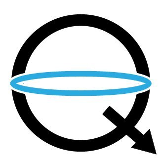

## Hi there, I am Harsh and you can call me....Harsh (he/him/his)👋

## Currently working on
* A Neural style transfer project where artistic features and style of an image will be transfered to another image.

* A stone paper scissors✂- Here, you can play game with your computer by showing the symbol from your hand and computer will recognize it automatically using webcom. I will be using a custom machine learning model to do so. The image data I will collect will be from Kaggle, web scrapping and possibly a custom data too.

## Planning to do next...
* Improve the Face detection project by-
   * Adding a new better trained model (probably by using `VGGFace` data).
   * Adding support for live webcam.
   * Its gonna be fun...🤩
* Create a ML algorithm to play chess.
  * Learn and understand `reinforcement learning`, then create an algorithm which can play chess with itself and create new stratigies from scratch.
  * Then make it play my school's chess club members.😂

## Techology & Tools

###### Expirienced in

###### Also learning

  
  
## Some of My Certificates...
|  |  |  |
| :-: | :-: | :-: |
|  |  | 
| |  | view more>> |

## Some of My Currently Enrolled Courses...
|  |  |  |
| :-: | :-: | :-: |
|  |  | 
| |  | view more>> |

## Our favourite offline dino game....Wanna play it?

<!--
**LordHarsh/LordHarsh** is a ✨ _special_ ✨ repository because its `README.md` (this file) appears on your GitHub profile.

Here are some ideas to get you started:

- 🔭 I’m currently working on ...
- 🌱 I’m currently learning ...
- 👯 I’m looking to collaborate on ...
- 🤔 I’m looking for help with ...
- 💬 Ask me about ...
- 📫 How to reach me: ...
- 😄 Pronouns: ...
- ⚡ Fun fact: ...
-->
