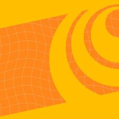

# Work in progress

##### These are the courses which are currently I am doing.

## Introduction to Quantum Computing with IBM Quantum
##### [The Coding School](https://www.codeconnects.org/)'s Qubit by Qubits's [Intrduction to Quantum Computing with IBM Quantum](https://www.qubitbyqubit.org/programs) is six months course which is divided into two semesters of three months each.
Students are selected for this course from all over the world through a statement of interest. Luckily, I was one of them🎉. The first semester is about the basics requiered for Quantum Qumputing (including mathematics, physics and programming) and the second is about the actual Quantum Computing. You can register for it [here](https://www.qubitbyqubit.org/register).

<table>
  <tr>
    <th width="50%"></th>
    <th width="50%"></th>
  </tr>
  <tr>
    <th colspan="2" width="80%"></th>
  </tr>
<table>
  
  

 

## Coursera

###### I am currently doing two Coursera Specializations

<table width="100%">
  <tr>
    <th  width="48%"></th>
    <th  width="4%"> </th>
    <th  width="48%"></th>
  </tr>
  <tr>
    <th  width="48%"><a href="https://www.coursera.org/specializations/executive-data-science" title="Alt+click">Executive Data Science</a></th>
    <th  width="4%"> </th>
    <th  width="48%"><a href="https://www.coursera.org/professional-certificates/tensorflow-in-practice" title="Alt+click">Deeplearning.ai TensorFlow Developer</a></th>
  </tr>
    <tr>
    <td  width="48%">I am taking this course to deepen my knowlwdge about data science. Though I done a lot things related to data science but I am still lacking the core concepts and understanding of Data Science. So, I am taking this coursse by <b>John Hopkins University</b>. It's taught by <b>Jeff Leek</b> and will be taking about <b>2 months</b>.</td>
    <td  width="4%"> </td>
    <td  width="48%">This is a specialization on TensorFlow taught by <b>Laurence Moroney</b>. TensorFlow is a vast framework so I am taking it to increase by ability to do more with this platform. It's a <b>4 month</b> course from <b>Deeplearning.ai</b>.</td>
  </tr>
</table>

 

## SWAYAM

###### I am currently enrolled to 3 courses on this indian MOOC platform [link here](https://swayam.gov.in/). All of these three are developed by NPTEL techers.

<table>
<tr>
  <th width="50%"></th>
  <td rowspan="2"><b>The two courses are-</b> <dl><dt><a href="https://onlinecourses.nptel.ac.in/noc21_cs25/preview">Reinforcement Learning-</a></dt><dd>This is a nice branch of deep learning. After this I will be making my first project which will be a chess playing algorithm.</dd><dt><a href="https://onlinecourses.nptel.ac.in/noc21_cs16/preview">Cryptography and Network Security-</a></dt><dd>This is something that I wanted to learn from a long time.😤</dd><dt><a href="https://onlinecourses.nptel.ac.in/noc21_cs14/preview">Cloud Computing-</a></dt><dd>This is just to know more about cloud computing, how it actually works, its hardware and software, etc.</dd></dl></td>
</tr>
<tr>
  <th></th>
</tr>
</table>
